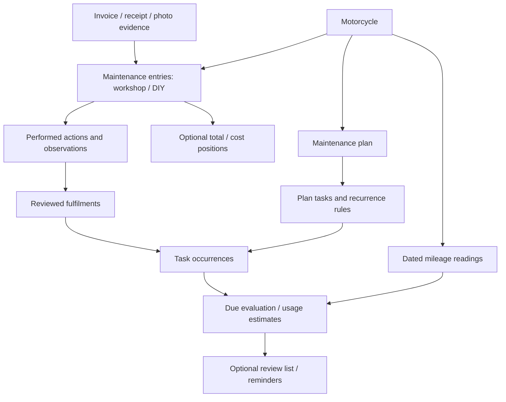

# Maintenance domain model

Status: model foundation implemented, 2026-10-09. The user approved starting the
models after the design discussion. The sections below describe the wider direction;
forecasts, reminders, check-ins and new client workflows remain exploratory.

## Implemented foundation

- `MileageReading`: dated observations preserving original value/units, exact or
  approximate certainty, origin and optional actor, entry and document attribution.
  Creating a reading does not convert units or update `Motorcycle.odometer_km`.
- `MaintenanceRecord` remains the entry container. It now records origin, performer,
  optional workshop, recorder and duration; `MaintenanceAction` records operation,
  component, optional position and findings. Unclassified narrative remains valid.
- `MaintenanceCostItem` stores optional detailed costs on any entry. Invoice-derived
  positions reference original `MaintenanceInvoiceItem` rows; invoice facts and reported
  entry totals remain intact. These are projections, not additional spending.
- `EvidenceDocument` retains private storage metadata and account ownership. The
  `maintenance_evidence` association supports several entries, including different
  motorcycles belonging to the same account. File bytes are not copied.
- `MaintenancePlan` and `MaintenanceTask` hold attributable rules, nullable baselines,
  distance/time intervals or milestone targets. Defaults are draft plans and manual
  tasks; no manufacturer rules, intervals or zero baselines are invented.
- `MaintenanceTaskOccurrence` stores explicit occurrences with optional due date/mileage
  and lifecycle status. `MaintenanceFulfilment` associates reviewed performed actions
  with particular occurrences. Occurrences are not automatically generated.
- Backend association actions enforce permissions and same-account evidence attachment;
  fulfilment also requires the same motorcycle, operation, component and position.
  An action cannot fulfil multiple occurrences of the same task. Partial fulfilments
  can be completed explicitly; skipped occurrences and work before an occurrence
  window are rejected. Activity events are recorded in the same transaction.
- Factories and an opt-in `MaintenanceDomainSeeder` provide coherent example data. The
  seeder is not part of default bootstrap and was not run against the user's database.

The schema and data migrations are
`2026_10_09_115125_create_maintenance_domain_tables.php` and
`2026_10_09_115126_backfill_maintenance_evidence_and_costs.php`. Existing imports become
private evidence documents; confirmed invoices gain evidence links and general cost
positions. No legacy actions, mileage readings, task completions or unknown actors
are guessed. Original invoice rows and stored files are preserved.

New uploads create an evidence document transactionally; confirmations attach it and
project financial positions. The public invoice and maintenance API contracts remain
unchanged. Existing maintenance date/mileage requirements still apply.

## Verification of this slice

- Full Sail server suite: 178 tests, 915 assertions, passing.
- Larastan/PHPStan and the full Pint formatting gate pass; `git diff --check` is clean.
- Both migrations applied to the local MySQL database. The existing 1 motorcycle,
  3 maintenance entries, 5 imports, 3 invoices and 8 original invoice items remain.
  Backfill added 5 evidence documents, 3 evidence links and 8 general cost positions;
  SQL comparison found no document ownership/path/hash or financial projection mismatch.
- Tests cover independent readings, DIY costs, reusable private evidence, account and
  verification boundaries, partial/idempotent fulfilment, incompatible operations or
  positions, occurrence windows, prevention of reuse across cycles, database constraints,
  repeatable backfill and upload/confirmation integration.
- No frontend contract or UI changes in this slice; no browser/device validation applies
  to the newly internal model foundation. Horizon workers were reloaded after migration.

## Next implementation decisions

1. Add an authoritative record-mileage action, validation, activity event and shared
   client flow. Define surprising/decreasing readings, corrections, canonical unit
   conversion and reconciliation with the existing current-mileage display first.
2. Extend manual history with optional performer, structured actions and costs. Define
   unknown/approximate dates and mileage through explicit server and client contracts.
3. Add reviewed plan/task authoring and fulfilment interfaces. Define immutable rule
   snapshots or revision behavior before editing active rules or completed actions;
   existing fulfilments must be reevaluated when supporting facts change.
4. Define recurrence generation, baseline selection and due evaluation. Only then add
   gap questions, usage estimates, optional check-ins and notifications.

The association actions are internal foundations, not newly exposed API endpoints.
Ordinary Eloquent relationships are persistence tools, not an authorization boundary;
future write actions must enforce account scope for all optional evidence/history links,
validate numeric and schedule inputs, and record attribution. Condition tasks currently
retain descriptive notes; structured condition evaluation is not implemented.

## Purpose

Build useful motorcycle history from workshop invoices, DIY work, user statements
and dated mileage readings. Later, use that history and attributable service rules
to identify missing information, suggest check-ins and estimate upcoming maintenance.
AI can help collect and interpret information; application actions own persistence,
validation, permissions and scheduling calculations.

The user can record a sentence, optionally add a total cost, or provide detailed
positions. Invoices and plans are optional. Recording work should remain useful
without configuring a schedule, supplying a receipt or enabling AI.

## Candidate concepts

| Concept | Responsibility |
| --- | --- |
| Motorcycle | The bike and its relevant identity/configuration. |
| Mileage reading | An odometer observation with an observation date, units, source and certainty. |
| Maintenance entry | A record of a visit or DIY session, with narrative, optional date/mileage, performer and costs. |
| Performed action | A specific thing actually done within an entry: inspect, clean, lubricate, adjust, repair or replace, scoped to a component. |
| Maintenance plan | The active set of service rules for a motorcycle, with sources and explicit user choices. |
| Plan task | A particular action/scope and its recurrence or condition rule. |
| Task occurrence | A particular instance of a planned task, with its due basis and completion history. |
| Fulfilment | A reviewed association between a performed action and a task occurrence. |
| Evidence document | An invoice, receipt, photo or other attachment supporting recorded facts. |
| Cost position | Optional detailed parts/materials/labor/discount costs on an entry, independent of an invoice. |
| Check-in preference | Optional cadence for asking about mileage, history or observations. |

The implemented service occurrences belong to maintenance tasks. They are not a
general application task framework; optional check-ins remain a separate future concern.

## Recorded history

A maintenance entry is an event container. Its narrative can stand alone; structured
performed actions can be added later. One entry may contain several actions, and one
invoice may support several actions or entries. Work can exist without any evidence.
Evidence alone does not establish completion: buying an oil filter is not proof of
installing it, and an invoice line may describe proposed rather than completed work.

Keep separate:

- When work happened, when an invoice was issued and when data was entered.
- The person/workshop who did the work, the actor recording it and the input channel.
- Original document facts, AI extraction suggestions and the reviewed domain record.
- Work that was performed and an observation such as "chain inspected; wear found".

Dates/mileage may be exact, approximate or unknown. A recollection such as "last
spring, around 40,000 km" must retain its uncertainty rather than becoming a fabricated
exact date. The representation of ranges and date precision is still open.
Invoice mileage can establish a dated observation when its meaning/date is known;
an invoice's issue date is not automatically its service or observation date.

Performed actions need enough scope to distinguish front/rear tyres, front/rear
brakes and chain inspection/lubrication/replacement. Invoice wording can suggest an
action, but classification and task fulfilment must remain reviewable. Preserve
unclassified prose instead of forcing every entry into a predetermined taxonomy.

## Mileage readings

A user can record mileage on any date without a maintenance entry. A future AI
conversation calls the same record-reading action as a form, clarifying motorcycle,
units or surprising values when necessary. "Today" uses the user's local date.

Keep the original value/units and attribution; define canonical conversion before
mixing km and miles. Distinguish the observation date from the record creation time.
Backdated entries and corrections should not overwrite unrelated observations or
blindly change the current-mileage display. Multiple sources can describe the same
observation; detecting that is different from deleting two readings with equal values.

A decrease can mean a mistake, odometer replacement/rollover or a different vehicle.
It requires clarification, not automatic rejection or acceptance. The reconciliation
policy and support for odometer discontinuities are open decisions. Corrections must
remain attributable; do not build an immutable event store solely for this feature.

Usage estimates require consistent, dated readings with positive elapsed time.
Insufficient, conflicting or stale readings yield an unknown/limited estimate.
Forecasts never become recorded odometer facts. Seasonality, storage periods and
changes in usage should remain visible limitations rather than hidden precision.

## Plans, tasks and fulfilment

A plan task describes a specific action, scope and scheduling basis. Possible bases:

- Distance since the last qualifying action.
- Calendar time since that action, or fixed mileage/date milestones.
- Distance or calendar time, whichever comes first, when the rule says so.
- An observed condition or a one-off recommendation requiring review.

Manufacturer guidance, workshop advice and user-selected intervals are distinct
sources. Keep applicability (model/year/variant where relevant), source reference,
version and effective date. A user preference must not be labelled manufacturer advice.
AI must not invent maintenance intervals, compatibility or repair recommendations.
A reminder threshold and a replacement requirement are different things.

An inspection does not reset a replacement interval. A replacement may fulfil several
related tasks only when their qualifying rules explicitly allow it. Partial work should
complete only the relevant actions. Generic prose such as "brake service" does not
prove which brake components were inspected or replaced.

Fulfilment links performed actions to particular occurrences, not just permanently to
a recurring task definition. Otherwise one old invoice could mark every future
occurrence complete. The foundation stores explicit occurrences; their automatic generation policy
remains open. Multiple pieces of evidence can support the same completion.

Keep these dimensions separate:

- Knowledge: sufficient history, missing history or conflicting history.
- Schedule evaluation: upcoming/due/overdue when it can be calculated.
- Occurrence lifecycle: open, partially completed, completed or explicitly skipped.

"No chain service recorded" describes our information. It does not prove neglected
maintenance or establish the chain's physical state. Ask what was last inspected,
lubricated or replaced, and accept a history entry without requiring an invoice.
Snoozing a reminder or skipping a task must not pretend the work was performed.
Edits or removal of supporting history must trigger reevaluation of affected tasks.

## Optional costs

An entry may have no cost, a reported total/currency, detailed positions, or both.
Unknown cost differs from zero cost. A DIY entry may include materials, outsourced
labor and optional duration; personal time should not acquire an invented monetary rate.

Keep money as decimal values and currency explicit. Preserve reported totals separately
from calculated line sums, with net/gross/tax meaning clear. Discounts and invoice
rounding can create differences worth reviewing. A financial position is not itself a
performed service action; several positions can support one action and vice versa.

Invoices retain their original financial facts. Entry costs should become usable
independently of invoices. Do not count both an invoice total and its copied entry
total as separate spending. One receipt may purchase supplies for several later jobs;
one invoice may cover several bikes. Allocation, remaining stock, currency conversion,
refunds and credit notes are open decisions, not assumed features.

## Check-ins and later AI behavior

A weekly/monthly review list could ask for a mileage update, clarification of an
unknown service baseline or a check of an upcoming task. These check-ins are optional
and distinct from manufacturer service tasks. Completing a mileage check-in creates
a reading; it does not complete maintenance.

Keep cadence, user timezone, opt-in, snooze/disable controls and duplicate suppression
explicit. Repeated reminders should refer to the same outstanding question/task rather
than create a new overdue item every week. Notification delivery is a later concern.

AI can suggest performed-action categories, explain known gaps with evidence, ask
focused questions and record authorized answers through application actions. It should
avoid repeating answered questions and retain unknowns when the user cannot answer.
Conversation text is not the authoritative maintenance database. User activity supports
attribution; domain history supplies current facts and evidence. Keep account access
and the provenance of user reports/AI suggestions visible.

## Fit with the existing implementation

- `Motorcycle.odometer_km` is currently a scalar; it is not a dated reading history.
- `MaintenanceRecord` already supports manual prose and optional total/currency.
  Date/mileage are currently required; supporting unknown history needs an explicit
  contract change in Laravel and both clients.
- `MaintenanceInvoice` and its items preserve original financial evidence. General entry
  cost positions now support invoice projections and independent DIY costs.
- The importer currently confirms one invoice into one maintenance entry. Broader
  evidence associations and service actions now exist as internal model foundations;
  their public recording/review interfaces remain future changes.
- Existing activity events, owner permissions and shared client behavior remain useful
  foundations. Backend actions own recording/fulfilment; web/mobile/AI provide adapters.

The model foundation is approved and implemented. Further capabilities such as mileage
recording interfaces, plan authoring, forecasts and recurring check-ins need their own
concrete behavior decisions; this document does not authorize building all of them.

## Things to revisit as the product develops

- Shared bikes, ownership changes, transferred history and permissions for workshops.
- Service performed without known mileage, imported older history and contradictory sources.
- Component replacement history and changing configuration; a replaced rear tyre should
  not reset the front tyre's history.
- Recalls, warranty work and one-off repairs versus routine service.
- Multi-bike visits, duplicate uploads, receipts for purchases and partial invoice allocation.
- User corrections, deletions, plan changes and source withdrawal without losing attribution.
- Seasonal use, prolonged storage, unit changes and odometer replacement.
- Whether plans start from purchase/installation, last service, a fixed milestone or an
  explicitly entered baseline. Unknown baselines cannot silently default to zero.
- Which completions need review and when previously authorized AI recording is sufficient.
- Evidence retention/deletion and the distinction between attachments, history and activity.

Resolve these against concrete user flows. Prefer a few well-defined concepts over
anticipating every case with flags or a universal workflow framework.
